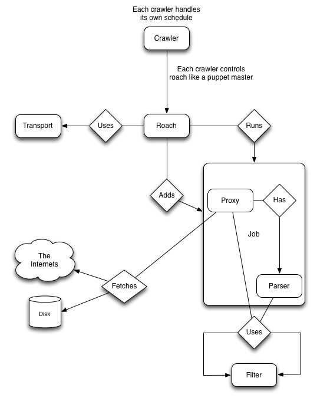
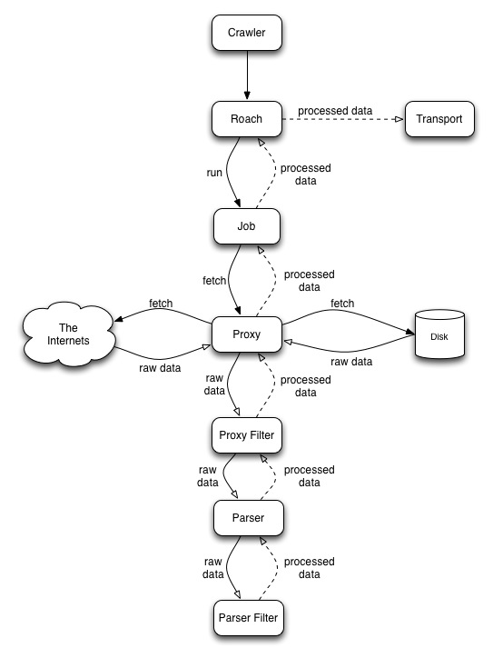

# Roach

> A very adaptable web crawler framework. Impossible to kill.


[](https://travis-ci.org/PetroFeed/roach)

## Getting Started

1. Install the module via npm:
  
```
npm install roach
```

## Usage

### Single Document, Roach Filter, Multiple Transports

```js
var Roach = require('roach');

var roach = new Roach();

// Use multiple transports with default options
roach.use('rabbitmq').use('mongodb');

// Add a job to get all the 'a' links from google.com
roach.addJob( 'http://google.com', 'google' ).filter( 'links' );

// run the job
roach.run();
```

### Multiple Documents, Roach Filter, Multiple Transports

```js
var Roach = require('roach'),
    Proxy = Roach.Proxy;

var roach = new Roach();

// Use multiple transports with default options
roach.use('rabbitmq').use('mongodb');

var proxy = new Proxy( 'http://google.com', 'google' );

proxy.filter('links')
     .each(function(url, index){
        roach.addJob(url, 'job:' + index)
             .filter('filters/xml_parser.js');
      })
     .run(function(){
        roach.run();
      });
```

### Reading From File System, Custom Proxy & Parser Filters

**Note:** Custom filters need to end with `.js` (crappy I know, but it was tricky to automatically resolve your filters vs. our custom ones.)

```js
var Roach = require('roach'),
    Proxy = Roach.Proxy;

var roach = new Roach();

var config = roach.config('config.json');

roach.use('redis', config.transports.redis);

var proxy = new Proxy( '/tmp', 'awesomesauce' );

// Use the Roach directory filter and a custom filter
// to grab every .txt file the '/tmp' directory
proxy.filter( 'directory' )
	 .filter( 'filters/text_file.js' )
	 .each(function(filepath, index){

	 	// Apply some custom filters to each job that 
	 	// gets created from each fetched file
	    roach.addJob(filepath, 'job:' + index)
	         .filter('filters/special_error.js')
	         .filter('filters/every_third_word.js');
	 })
	 .run(function(){
	    roach.run();
	 });
```

## Architecture



### Data Flow



### Job

TODO

### Proxy

TODO

### Parser

TODO

### Filters

TODO

### Transports

Roach has multiple transports that can be used to save your data somewhere. They all have default options that are specific to the individual transport. The options can be overridden by passing in an options object like so:

```js
roach.use('rabbitmq', { host: '192.168.1.1', port: 8001 });
```

All the transports should adhere to the same basic interface and they pretty simple to implement so feel free to write your own!

#### Logger

This is as simple as it gets. It just spits stuff out to console. Useful for debugging or just piping results to a file.

**Defaults:**

```js
{
    name : 'logger'
}

```

#### File

For saving to file system.

**Defaults:**

```js
{
    path : path.resolve('/tmp'),
    name: 'file',
    filename: 'data:'
}

```

#### MongoDB

Saving to a single collection. No replica set support at the moment. Single DB only.

**Defaults:**

```js
{
    protocol : 'mongo',
    name: 'mongodb',
    host : 'localhost',
    port : '27017',
    db: 'roach',
    collection: 'roach',
    safe: true
}

```


#### RabbitMQ

Obviously, saving to RabbitMQ.

**Defaults:**

```js
{
    protocol : 'amqp',
    name: 'rabbitmq',
    host : 'localhost',
    port : '5672',
    exchange : {
        name: 'roach',
        options: {
            durable : true,
            confirm : true
        }
    },
    login: 'guest',
    password: 'guest',
    vhost: '/',
    routingKey: '#'
}
```

#### Redis (in progress)

Saving to Redis. Right now this is tightly coupled to our own use case, so it currently saves a key to a set and then saves the key + a score + the data to a sorted set. We plan on abstracting so that you can determine your save method or override the default.

**Defaults:**

```js
{
    protocol : 'redis',
    name: 'redis',
    host : 'localhost',
    port : 6379
}
```

### Utils

We provide a few helpful utility libraries wrapped up in the `Roach.Utils` namespace. At the moment they are:

* `Roach.Utils._` -> [underscore](http://underscorejs.org)
* `Roach.Utils._.str` -> [underscore-string](http://epeli.github.io/underscore.string/)
* `Roach.Utils.date` -> [moment](http://momentjs.com)
* `Roach.Utils.request` -> Helpful utilities for making http requests

## License

**Creative Commons 3.0 - Attribution Sharealike**

You can remix, copy or use for both commercial and non-commercial products and services but you need to provide attribution for the original work in the source code to *"PetroFeed Inc."*. You must also share the original or any derivative under the same license. A description of the license can be found [here](http://creativecommons.org/licenses/by-sa/3.0).

---

Proudly brought to you by [PetroFeed](http://PetroFeed.com).


