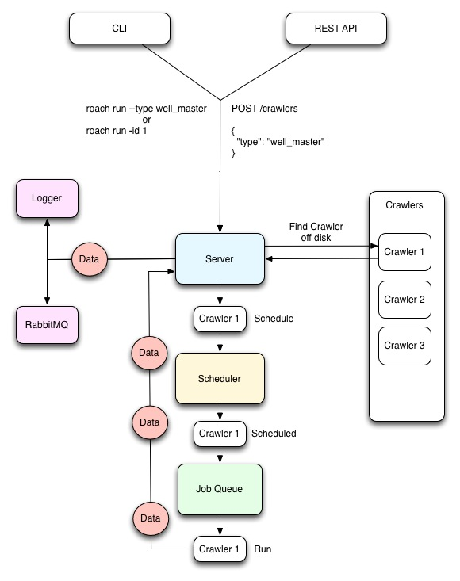

# Roach

> A very adaptable web crawler framework. Impossible to kill.


## Getting Started

1. Clone the repo or download the zip file from here

2. `cd path/to/roach2`
  
3. Install dependencies

```
npm install
```

## Usage

TODO

## Architecture




### Server

TODO

### Scheduler

TODO

### Queue

TODO

### Crawler

TODO

### Steps

TODO

### Transports

Roach has multiple transports that can be used to save your data somewhere. They all have default options that are specific to the individual transport. The options can be overridden by passing in an options object like so:

```js
roach.use('rabbitmq', { host: '192.168.1.1', port: 8001 });
```

All the transports should adhere to the same basic interface and they pretty simple to implement so feel free to write your own!

#### Logger

This is as simple as it gets. It just spits stuff out to console. Useful for debugging or just piping results to a file.

**Defaults:**

```js
{
    name : 'logger'
}

```

#### File

For saving to file system.

**Defaults:**

```js
{
    path : path.resolve('/tmp'),
    name: 'file',
    filename: 'data:'
}

```

#### MongoDB

Saving to a single collection. No replica set support at the moment. Single DB only.

**Defaults:**

```js
{
    protocol : 'mongo',
    name: 'mongodb',
    host : 'localhost',
    port : '27017',
    db: 'roach',
    collection: 'roach',
    safe: true
}

```


#### RabbitMQ

Obviously, saving to RabbitMQ.

**Defaults:**

```js
{
    protocol : 'amqp',
    name: 'rabbitmq',
    host : 'localhost',
    port : '5672',
    exchange : {
        name: 'roach',
        options: {
            durable : true,
            confirm : true
        }
    },
    login: 'guest',
    password: 'guest',
    vhost: '/',
    routingKey: '#'
}
```

#### Redis (in progress)

Saving to Redis. Right now this is tightly coupled to our own use case, so it currently saves a key to a set and then saves the key + a score + the data to a sorted set. We plan on abstracting so that you can determine your save method or override the default.

**Defaults:**

```js
{
    protocol : 'redis',
    name: 'redis',
    host : 'localhost',
    port : 6379
}
```

### Utils

We provide a few helpful utility libraries wrapped up in the `Roach.Utils` namespace. At the moment they are:

* `Roach.Utils` -> Various little helpful utilities
* `Roach.Utils._` -> [underscore](http://underscorejs.org)
* `Roach.Utils._.str` -> [underscore-string](http://epeli.github.io/underscore.string/)
* `Roach.Utils.date` -> [moment](http://momentjs.com)

---

Proudly brought to you by [PetroFeed](http://PetroFeed.com).


